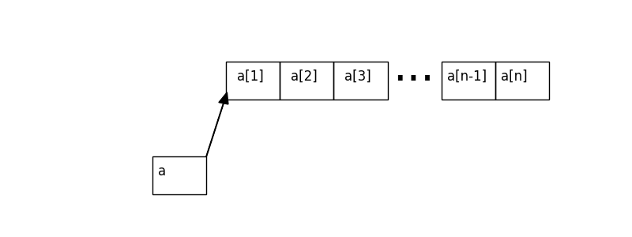
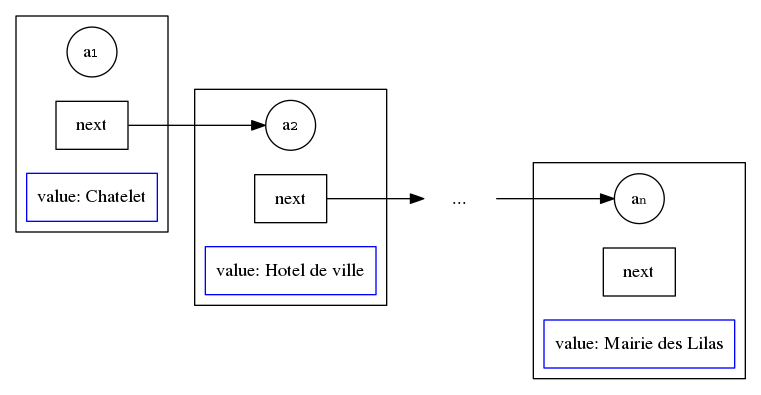
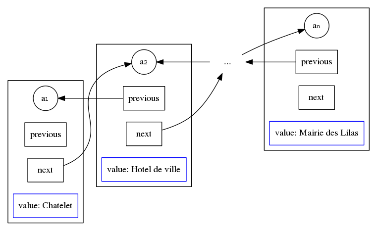
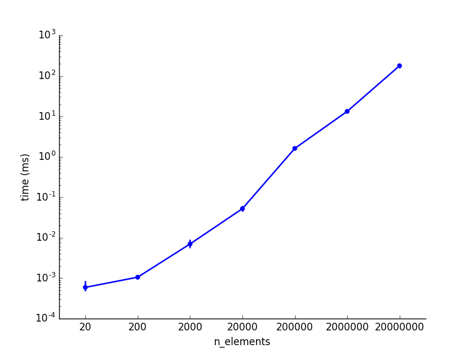

# Introduction aux structures de données et algorithmes


***


## Qu'est-ce qu'on va apprendre dans ce cours?


***


## Aujourd'hui: structures de données de base


***


## L'importance de bien représenter les données

- (LXXXI + IX) / X ?


***


## L'importance de bien représenter ses données

- (LXXXI + IX) / X ?
- (81 + 9) / 10 ?

On va illustrer cette idée en manipulant différentes structures de données.


---


## comment représenter une séquence

 - on a souvent besoin de manipuler une séquence de valeurs.
 - par exemple:
     * l'historique des températures à Paris depuis janvier 2018
     * la liste des arrêts d'une ligne de bus
     * les commandes à préparer dans un fast-food

 - on va numéroter (indicer) les éléments de la séquence: ```a₁, a₂, ..., aₙ```


***


## exemple: une chaine de caractères

 ```"belleville citoyenne"```

```['b', 'e', 'l', 'l', ... , 'n', 'e']```

```a₁='b', a₂='e', a₃='l', ... , a₂₀='e'```


***


## exemple: une ligne de métro

```["Châtelet", "Hôtel de ville", ... , "Mairie des Lilas"]```

```a₁="Châtelet", ... , a₁₃="Mairie des Lilas"```


***


## exemple: un enregistrement audio


```[12.7, 4.25, 5.19, ... , -0., -0.11]```

<!-- a_4616551 = -0.11 -->
```a₁=12.7, a₂=4.25, ... ```


---


## Comment représenter une séquence?

- sur le papier, on a écrit ```a₁, a₂, ..., aₙ```
- en pratique, il faut représenter ces données dans la mémoire d'une machine.
- plusieurs solutions existent, on choisit en fonction des opérations qu'on veut
  pouvoir faire.


---


## Tableaux

- si tous les éléments de ma séquence ont la même taille, je peux les ranger les
  uns à côté des autres dans la mémoire.


***


## Tableaux




***


## Tableaux


- ce sont les "typed arrays" en javascript: `Int32Array`, `Float64Array`, ...
- https://developer.mozilla.org/en-US/docs/Web/JavaScript/Typed_arrays


***


## Tableaux: random access

- comment savoir la valeur de ```a₇```?


***


## Tableaux: random access

- comment savoir la valeur de ```a₇```?
- début + 6 * (la taille d'une case)
- ça prend un temps "constant": indépendant de la taille du tableau

***


## Tableaux: parcours


```
a = [a₁, ... , aₙ]
i = 1
tant que i <= n:
   traiter a[i]
```

- ça prend un temps proportionnel à ```n```


***


## Exercice

- Que faut-il faire pour insérer un élément au milieu ou a début d'un tableau?
- À peu près combien d'opérations sont nécéssaires (en fonction de la taille du
  tableau)?
- les `Array` proposent les méthodes `push` et `pop`. Est-ce le cas de
  `Float64Array`? Pourquoi?


***


## Tableaux: limites

- séquence d'objets qui n'ont pas la même taille?
- insertion au milieu d'un tableau?
- les tableaux peuvent être des structures trop rigides si la taille de notre
  séquence change dynamiquement, ou si on doit pouvoir insérer ou supprimer des
  éléments au milieu.


---


## Listes




***


## Listes




***


## Exercices ...


***


## Listes: parcours

```
elem = début de la liste
fini = faux

tant que !fini:
  traiter elem
  si elem.next:
    elem = elem.next
  sinon:
    fini = vrai
```


***


## Listes: random access?


- on ne connaît l'adesse de `a[i]` que si on a trouvé `a[i-1]`
- pour trouver ```a[i]```, il faut donc visiter les ```i``` premiers éléments de
  la liste: si ```i``` est grand, c'est beaucoup plus long que dans un tableau.
  
```
tant que index < i:
   elem = elem.next
   index++
```


***


## Listes: insertion


- par contre, insérer un élément est beaucoup plus facile: il suffit de mettre à
  jour l'attribut `next` de l'élément précédent.
- ça se fait en temps constant (indépendant de `n` et `i`)
- les listes offrent donc d'autres compromis que les tableaux


---


## Conclusion

- on a vu deux exemples de structures de données qui semblent similaires: les listes et les tableaux.
- on voit qu'en pratique, le choix d'une structure de données détermine quelles opérations seront faciles et rapides à réaliser.
- quand vous écrivez un programme, demandez vous:
    * quelles données je vais manipuler?
    * quelles opérations je vais devoir faire dessus?
    * comment représenter mes données pour que mon programme soit facile à écrire?


***


## Conclusion


- comment est-ce que vous choisiriez de représenter:
  * un signal audio?
  * les commandes en cours dans un fast-food?
  * ...


***


## Détail: insertion dans un `Array`





---


## Tri


***


## Tri par insertion

