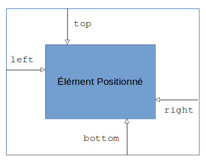

# CSS
## Le positionnement (2)
### Position, Float, Flex


---


## Le positionnement des élements


Les élements HTML se positionnent naturellement de la façon suivante :
- Les élements `block` se positionnent les uns sous les autres.
- les éléments `inline` et `inline-block` se positionnent les uns à la suite des autres.

Et cela dans l'ordre du document (le _flow_ en anglais).


***


### La propriété `position`

La propriété position permet de modifier le positionnement d'un élement.

Elle peut prendre 4 valeurs :
- `static` (la valeur par défaut)
- `relative`
- `absolute`
- `fixed`


Note: `position : static;`  positionne les éléments comme vu précédemment.


***


### Les propriétés de positionnement

Quand la position n'est pas `static`, on dit que l'élement est **positionné**.

On utilisera alors les propriétés `left`, `top`, `right`, `bottom` pour spécifier la position de l'élement par rapport à un élement de référence.

Cet élement de référence dépend de la valeur de `position` utilisée.


***





---


### Le positionnement relatif

```
position : relative;
```

Un élement positionnés de manière relative est positionné par rapport à sa position initiale dans le _flow_.

Il occupe toujours de l'espace dans la page.

Cela permet notamment de décaler des élements.


***


```
position : relative;
left : 10px;
```

Cet élement sera affiché 10 pixels vers la **droite**.

Note: expliquer pourquoi left décale vers la droite -> car c'est la gauche de l'élément qu'on décale de 10px;


---


### Le positionnement absolu

```
position : absolute;
```

Un élement positionnés de manière absolue est positionné par rapport à son premier parent **positionné**.

Si aucun élément n'est positionné, il est positionné par rapport au `<body>`.

Il ne prend pas de place dans le _flow_ de la page.

Note: rappeler la déifinition de "positionné".


***


```
position : absolute;
top : 20px;
```

Cet élement sera affiché 20 pixels vers le **bas**.


---


### Le positionnement fixe
```
position : fixed;
```

Un élement positionnés de manière fixe est positionné par rapport à l'affichage.

Il ne prend pas de place dans le _flow_ de la page.

Il défile avec la page.


***


```
position : fixed;
top : 50px;
```

Cet élement sera affiché 50px sous le haut de la page et défilera avec la page.


---


### Z-Index

Quand des élements sont positionnés, il arrive qu'ils se chevauchent.

On utilise alors la propriété `z-index` pour définir quel élément se place devant ou derrière.

Plus le `z-index` est petit, plus l'élement s'affichera à l'arrière-plan.


---


### Overflow

On utilise la propriété `overflow` pour définir ce qu'il se passe quand un élement dépasse de son parent.

Les valeurs possibles sont :
 - `visible` : le contenu est visible
 - `hidden` : le contenu est caché
 - `scroll` : des barres de défilement sont toujours affichées
 - `auto` : des barres de défilement sont affichées si besoin

On peut utiliser `overflow-x` pour le dépassement horizontal et `overflow-y` pour le défilement vertical.


---


## FlexBox


---


## Eléments Flottants
