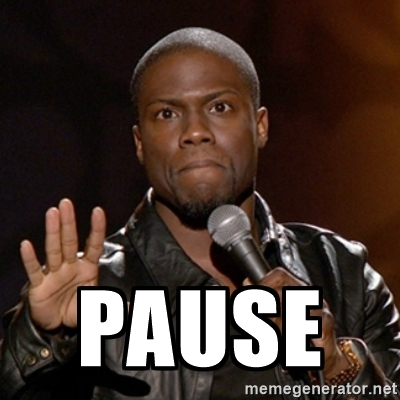
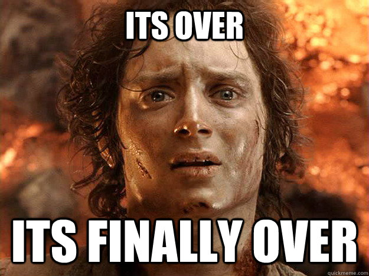

# Les media query et le responsive design


---


## Qu'est-ce qu'une media query ?
C'est une feature CSS3 qui permet d'adapter le style en fonction de certaines caractéristiques (comme la résolution de l'écran par exemple). Elle est appliquée sur un media type spécifique, par défaut ce dernier est `all`.

C'est principalement fait pour le responsive design.


---


## Mais attends, c'est quoi le responsive design ?
C'est créer un design pour qu'il soit adapté à la fois aux écrans d'ordinateurs, aux écrans mobiles, aux tablettes, aux larges résolutions, etc.

C'est quelque chose de très compliqué et surtout de fastidieux mais qui aujourd'hui est quasiment obligatoire.

Note: Ne vous en faites pas ça nous a été beaucoup facilité par CSS3 et certaines propriétés, comme le display flex, ou encore les media queries.


---


## Ready to start ?


---


## Comment fait-on une media query ?
Tout commence avec la définition de la query par le texte : `@media`.

Et ça ressemble à ça :

```css
@media (max-width: 600px) {
  .facet_sidebar {
    display: none;
  }
}
```


***


## Mais qu'est-ce qu'on met dans notre query ?
Des expressions qui nous permette de cibler un media.


---


## Les expression media


***


## Media-type
C'est l'expression la plus importante, avant d'écrire une media query en entier, il faut savoir à quel media celle-ci va servir.
Voici les media possibles


***


## Media-type
* all : Utilisé par défaut. C'est pour tout type de media
* aural : Utilisé pour les TTS (text to speech)
* braille : Utilisé pour les appareils qui affichent le texte  brail
* embossed : Utilisé par des appareils qui affichent la page web en brail
* handheld : Utilisé pour les petits appareils
* print : Utilisé pour les imprimantes
* projection : Utilisé pour les projections / présentations
* screen : Utilisé pour les écrans d'ordinateur
* tty : Utilisé pour afficher un site web dans un terminal
* tv : Utilisé pour les télévisions


***


## Les expressions
 Elles sont en fait des tests logiques et leur resultat est vrai ou faux. Elles sont reliées entre elles par des opérteurs logiques `and`, `,` (qui signifie `ou`), `not`, et `only`.

`color`,`color-index`,`aspect-ratio`,`grid`,`height`,`monochrome`,`orientation`,`resolution`,`scan` et `width` sont les seules supportées par tous les browsers actuellement.

Il y en avait d'autres mais bon... elles ont disparues.


***


## Quelques précisions
Certaines expressions peuvent être précédées de min/max spécifiant donc la valeur minimale ou la valeur maximale nécessaire.

Elles doivent obligatoirement être en parenthèse.


***


## color

Demande le nombre de bits utilisé par couleur.

|Valeur|Media|Accepte min/max|
|-|-|-|-|
|Nombre (integer)|media/visual|oui|

```css
@media (min-color: X) {
    //style here
}
```


***


## color-index

Indique le nombre d'entrée dans la CLUT*. C'est aussi basiquement le nombre de couleurs disponibles !

|Valeur|Media|Accepte min/max|
|-|-|-|-|
|Nombre (integer)|media/visual|oui|

```css
@media (min-color-index:256) {
    //style here
}
```


Note: A colour look-up table (CLUT) is a mechanism used to transform a range of input colours into another range of colours. It can be a hardware device built into an imaging system or a software function built into an image processing application. Basiquement ça définit la range de couleurs interprétée par le navigateur. 256 = 256 couleurs.


***


## aspect-ratio

Décrit le ratio de pixel souhaité.

|Valeur|Media|Accepte min/max|
|-|-|-|-|
|integer(h)/integer(w)|media/visual et media/tactile|oui|

```css
@media (min-aspect-ratio:1/1) {
    //style here
}
```


***


## grid

Détermine sur l'appareil utilisé est basé sur un systeme de grille. Exemple : terminal, ou télépone avec seulement une police, etc.  Si le device n'est pas une grid, alors la valeur est 0.

|Valeur|Media|Accepte min/max|
|-|-|-|-|
|boolean (0 ou 1)|all|non|

```css
@media (grid) {
    //style here
}
```

Note: S'utilise très bien avec handled


***


## height

Définit la hauteur voulue.

|Valeur|Media|Accepte min/max|
|-|-|-|-|
|longueur|all|oui|

Pour la longueur se référer aux unités CSS vues, ou [ici](https://developer.mozilla.org/en-US/docs/Web/CSS/length)

```css
@media (min-height: 500px) {
    //style here
}
```

Note: S'utilise généralement avec min ou max


***


## width

Définit la largeur voulue.

|Valeur|Media|Accepte min/max|
|-|-|-|-|
|longueur|all|oui|

Pour la largeur se référer aux unités CSS vues, ou [ici](https://developer.mozilla.org/en-US/docs/Web/CSS/length)

```css
@media (min-width: 200px) {
    //style here
}
```

Note: S'utilise généralement avec min ou max


***


## monochrome

Indique le nombre de bits par pixel pour un monochrome (de blanc à noir). Si l'appareil n'est pas un monochrome, alors la valeur est 0.

|Valeur|Media|Accepte min/max|
|-|-|-|-|
|longueur|media/visual|oui|

```css
@media (monochrome) {
    //style here
}
```

***


## orientation

Détermine si l'écran est plus haut que large ou inversement.

|Valeur|Media|Accepte min/max|
|-|-|-|-|
|landscape ou portrait|media/visual|non|

```css
@media (orientation: portrait) {
    //style here
}
```


***


## resolution

Indique la résolution (densité de pixel) de l'appareil

|Valeur|Media|Accepte min/max|
|-|-|-|-|
|dpi,dpcm ou dppx|media/visual|oui|

```css
@media screen and (min-resolution: 2dppx) {
    //style here
}
```

Note: Dots per inches, dots per centimeters, dots per pixels

***


## scan

Indique la résolution (densité de pixel) de l'appareil

|Valeur|Media|Accepte min/max|
|-|-|-|-|
|progressive ou interlace|media/tv|non|

```css
@media tv and (scan: interlace) {
    //style here
}
```

Note: Interlace seulement la moitié de l'image affiché, la prochaine suit juste après (perfs). Progressive, la totale tout de suite, mais plus gourmand


***


## PAUSE !



***


## Les opérateurs logiques


***


## and
`and` signifie `et` en anglais et permet de vérifier si telle expression ET l'expression suivante sont vraies. Si c'est le cas, alors la media query s'applique.


***


## ,
Comme en CSS classique, la virgule signifie que si telle expression ou celle qui suit est vraie alors la media query s'applique.


***


## not
Ce mot clé nous permet de signifier que si l'expression n'est pas vérifié alors on applique la media query.


***


## only
Cela évite que les anciens browsers qui ne sont pas à jour de charger le contenu de la media query.


---


## Mais où est-ce qu'on définit le style ?
Parce que c'est un peu flou tout ça !

A l'intérieur !

```css
@media (max-width: 600px) {
  .facet_sidebar {
    display: none;
  }
}
```


***


## Un petit résumé en BNF

```BNF
media_query_list: <media_query> [, <media_query> ]*
media_query: [[only | not]? <media_type> [ and <expression> ]*]
  | <expression> [ and <expression> ]*
expression: ( <media_feature> [: <value>]? )
media_type: all | aural | braille | handheld | print |
  projection | screen | tty | tv | embossed | speech
media_feature: width | min-width | max-width
  | height | min-height | max-height
  | aspect-ratio | min-aspect-ratio | max-aspect-ratio
  | color | min-color | max-color
  | color-index | min-color-index | max-color-index
  | monochrome | min-monochrome | max-monochrome
  | resolution | min-resolution | max-resolution
  | scan | grid
```


***


## Ah oui et dernière chose !
On peut lier une feuille de style en ayant une condition media :

```html
<link rel="stylesheet" media="all and (min-width: 500px)" href="mediasheet.css" />
```


---


## Media query c'est fini



