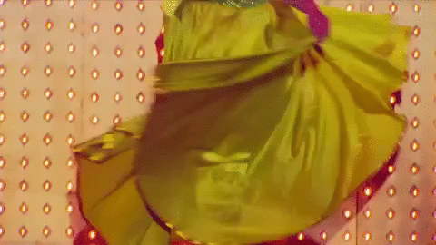

# Les Attributs HTML


---


Les attributs HTML s'écrivent en général de la manière suivante :

```
<balise attribut1="valeur1" attribut2="valeur2">Contenu</balise>
```
Il existe une forme courte pour certains attributs :
```
<balise attribut>Contenu</balise>
```


***


##Quelques informations et bonnes pratiques


- Tous les élements HTML peuvent avoir des attibuts.
- Ils servent à fournir des informations additionelles sur la balise.
- On écrit toujours les attributs dans la balise ouvrante et en minuscule
- La valeur des attributs entourée de guillemets `"` (simple ou doubles) que l'on nomme `quote`


---


## Liens


***


##href

L'attribut **href** sert principalement à définir la cible d'un lien HTML (**a**).

```
<a href="http://www.google.com">Un lien vers Google</a>
```


***


##target

L'attribut **target** sert à spécifier où ouvrir le lien.
```
<a href="http://www.google.com" target="_blank" >Un lien vers Google</a>
```
Valeurs possibles :
* `_self` Ouvre le lien dans la fenêtre courante
* `_blank` Ouvre le lien dans une nouvelle fenêtre


_d'autres que nous verrons en temps voulu !_


---


## Images / media
## src

L'attribut **src** sert à définir l'emplacement d'une image ou d'un média (audio/vidéo).

```

```
Si l'image n'est pas trouvée, on peut utiliser l'attribut **alt** pour afficher un texte à la place.


***


#Attributs uniques aux images
Pour spécifier la taille de votre image, vous pouvez utiliser les attributs HTML `width` (largeur) et `height` hauteur. La valeur que vous leur donnez sera en pixel uniquement (avant HTML5 vous pouviez aussi la spécifier en `%`)
Note: Mais les spécifications HTML5 étant de maximiser la compatibilité cross-browsers, il a falu faire un choix !)


---


## title

L'attribut **title** sert à définir une indication sur un élement, qui s'affiche au passge de la souris (_hover_).

```
<p title="Une indication s'affiche !">
  Un paragraphe avec un attribut title.
</p>
```
><p title="Une indication s'affiche !">
  Un paragraphe avec un attribut title.
</p>


---


## class

L'attribut **class** sert à identifier un groupe d'éléments possédant des caractéristiques communes.

On ajouter plusieurs _classes_ à un élement en les séparant par des espaces.


```
<p class="class1 class2">
  Un paragraphe avec un attribut class.
  Cet attribut définit deux classes : class1 et class2.
</p>
```

Cet attribut sera utilisé pour identifier des groupes d'élements en CSS ou en JavaScript.


---


## id

L'attribut **id** sert à identifier un élément spécifique.

```
<p id="paragraphe1234">
  Un paragraphe avec un attribut id.
</p>
```

Cet attribut sera utilisé pour identifier des élements en CSS ou en JavaScript.

L'id d'un élément doit être unique sur la page.


---


#Olé !



---


#Application
Créer un menu avec une liste à puces

Pro Tip : pour faire référence aux id, utiliser le caractère `#`.
