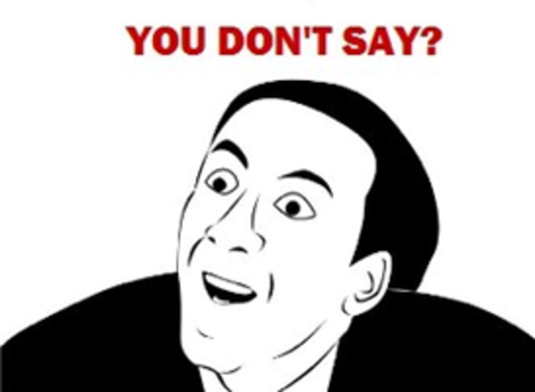

# Les élements structurants

Vous vous souvenez, on en a parlé rapidement !  
Le langage HTML vous permet d'écrire votre contenu de page, mais aussi de le structurer !


---


# Petit historique


***


Avec la version 4 du langage, chacun y allait à sa manière et utilisait principalement les attributs `class` et `id` pour délimiter leur contenu.

Avec HTML5 nous avons beaucoup de nouvelles balises pour faciliter tout cela !


---


## Les balises courantes


***


## Div
Une div (division) est un élément `block` (non `inline`) qui permet de regrouper du contenu.

On l'utilise généralement pour pouvoir appliquer du style à un conteneur.

```html
<div>
  
  
</div>
```

***


## Span
Un span est un élément `inline` (non `block`) qui permet de contenir un ou plusieurs autre élément `inline` : `<a>, , <b> ...` ou tout simplement du texte.

```html
<p>
  On commence à rentrer dans le
  <span id="vif">vif</span> du sujet
</p>
<p>
  <span class="qr">
    C'est quoi le vif du sujet ?
  </span>
  <span class="qr">
    Alors c'est quand ça
    commence à devenir intéressant !
  </span>
</p>
```


***


#Et c'est tout pour HTML4
Autant dire qu'on était limité !


---


# Et HTML5 alors ?
`<article>, <aside>, <details>, <footer>, <header>, <nav>, <section>, <summary>`


***


## Article
Cette balise sert à définir lorsque l'on définit un article.



***


```html
<article>
 <p>olé !</p>
</article>
```


***


## Aside
Elle définit une partie qui doit être mise sur le côté (d'où son nom)
```html
<aside>
 <p>olé !</p>
</aside>
```


***


## Details & summary
Elles permettent d'afficher en résumé quelque chose et de pouvoir afficher l'explication, exemple :

<details>
  <summary>\_blank ?</summary>
  <p>olé</p>
</details>


***


```html
<details>
  <summary>_blank ?</summary>
  <p>olé</p>
</details>
```


***


## Footer & header
Elles permettent de définit les zones : entêtes ou pieds de pages.

Cela peut concerner un article, une page web, etc.

Oh et il y a `<main>` aussi ! Celle-ci définit le contenu principal du document ou de la page web

```html
<header>
  <p>_blank</p>
</header>
<main>
</main>
<footer>
  <p>_blank</p>
</p>
```


***


## Nav
Elle permet de définir une partie de la page où seront des élements de navigation (que ce soit les principaux, ou non)

```html
<nav>
  <ul>
    <li><a href="#article1">Article1</a></li>
    <li><a href="#article2">Article2</a></li>
  </ul>
</nav>
```


***


## Section
Elle permet de définir une section au sein d'un document. Cela peut aussi être au sein d'un article.

```html
<article>
  <section>
    <p>_blank</p>
  </section>
  <section>
    <p>olé</p>
  </section>
</article>
```


---


## En résumé


---


## Les tableaux

On a vu qu'on pouvait structurer des élements avec des listes.  

Il existe une autre manière de le faire : les **tableaux**.


***


Les tableaux sont composés de lignes, de colonnes et de cellules.

En HTML, pour définir un tableau, on utilise la balise `<table>`.

On utilise la balise `<tr>` (_Table Row_) pour une ligne.


***


### Les cellules

On appelle _cellules_ les cases d'un tableau.
Il existe deux types de cellules en HTML :
- les cellules standard : `<td>` (_Table Data_)
- les cellules d'en-tête : `<th>` (_Table Header_)


***


### Un example

```html
<table>
  <tr class="table-title">
    <th>Cellules</th><th>de</th><th>titre</th>
  </tr>
  <tr>
    <td>_blank</td><td>is</td><td>cool ?</td>
  </tr>
  <tr>
    <td>Yes</td><td>it</td><td>is !</td>
  </tr>
</table>
```

<table>
  <tr class="table-title"><th>Cellules</th><th>de</th><th>titre</th></tr>
  <tr><td>\_blank</td><td>is</td><td>cool ?</td></tr>
  <tr><td>Yes</td><td>it</td><td>is !</td></tr>
</table>


***


Pour ajouter un titre au tableau, on utilise la balise `<caption>`.

```html
<table>
  <caption>Les profs de _blank</caption>
  <tr><th>Nom</th><th>Prénom</th></tr>
  <tr><td>Procureur</td><td>Marin</td></tr>
  <tr><td>Osouf</td><td>Erwan</td></tr>
  <tr><td colspan="2">Et les autres !</td></tr>
</table>
```

<table>
  <caption>Les profs de \_blank</caption>
  <tr>
    <th>Nom</th><th>Prénom</th>
  </tr>
  <tr>
    <td>Procureur</td><td>Marin</td>
  </tr>
  <tr>
    <td>Osouf</td><td>Erwan</td>
  </tr>
  <tr>
    <td colspan="2">Et les autres !</td>
  </tr>
</table>


***


### rowspan et colspan

Dans l'exemple précédent, on a utilisé l'attribut _colspan_ pour faire en sorte qu'une cellule s'étende sur 2 colonnes.

```
<tr><td colspan="2">Sur 2 colonnes !</td></tr>
```

On peut faire pareil avec l'attribut _rowspan_ pour les lignes.

On doit toujours respecter le bon nombre de cellules par ligne.


***


## Note sur le design

Il ne faut JAMAIS utiliser un tableau pour faire la mise en page d'un site.
