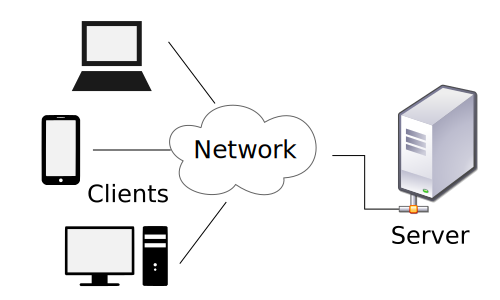

# Application Web avec Node.js


---


## Introduction

Jusqu'à présent, nous avons travaillé en "local", sur des fichiers "statiques" (c'est à dire que le navigateur charge les fichiers depuis le disque dur de notre ordinateur).

Nous allons maintenant voir une autre manière de structurer des applications.


---


## Le Modèle Client-Serveur


***


***


Le Modèle Client-Serveur est une manière de structurer les applications, en séparant les tâches entre :
 - le fournisseur d'une ressource ou d'un service (_le serveur_).
 - et celui qui les demandent (_le client_).

Ils communiquent en général à travers un réseau.

Le client et le serveur peuvent être sur une même machine ou deux machines séparées.


***




<span class="attribution">
Deriative work from
<a href="//commons.wikimedia.org/wiki/File:Gnome-fs-client.svg" title="File:Gnome-fs-client.svg">Gnome-fs-client.svg</a>: David Vignoni
<a href="//commons.wikimedia.org/wiki/File:Gnome-fs-server.svg" title="File:Gnome-fs-server.svg">Gnome-fs-server.svg</a>: David Vignoni
derivative work: <a href="//commons.wikimedia.org/wiki/User:Calimo" title="User:Calimo">Calimo</a>
(<a href="//commons.wikimedia.org/wiki/User_talk:Calimo" title="User talk:Calimo"><span class="signature-talk">talk</span></a>) -
<a href="//commons.wikimedia.org/wiki/File:Gnome-fs-client.svg" title="File:Gnome-fs-client.svg">Gnome-fs-client.svg</a>
<a href="//commons.wikimedia.org/wiki/File:Gnome-fs-server.svg" title="File:Gnome-fs-server.svg">Gnome-fs-server.svg</a>,
<a href="http://www.gnu.org/licenses/lgpl.html" title="GNU Lesser General Public License">LGPL</a>, <a href="https://commons.wikimedia.org/w/index.php?curid=15782858">Link</a>
</span>


***


Le client et le serveur sont deux **logiciels**, mais peuvent aussi désigner par extension la machine sur laquelle ils sont hébergés.

Exemple :
- Client : Firefox, Chrome, Mattermost, WhatsApp
- Serveur : Apache HTTP, Node.js http.Server


---


Faire l'exercice 1.


***


## Un serveur basique

Dans l'exercice 1, nous avons utilisé Node.js pour créer un serveur basique traitant une requête HTTP.

Il renvoie toujours la même réponse.

Nous allons voir comment ça marche


***


```javascript
var http = require('http');
```  
Charge le module [http](https://nodejs.org/dist/latest-v8.x/docs/api/http.html#http_class_http_server) de Node.js et le stocke dans la variable _http_.


***


```javascript
var server = http.createServer(function(request, response) {

    response.writeHead(200, {"Content-Type": "text/plain"});
    response.end("Hello World!");

});
```

Utilise la fonction `createServer` du module `http` de Node.js pour créer un Serveur HTTP et le stocker dans la variable _server_.

La fonction passée en paramètre sera exécutée à chaque requête.


***


```javascript
var port = 1337;
server.listen(port);
```

Associe (_bind_) le serveur au port 1337, pour traiter les requêtes arrivant sur ce port.


---


## Le protocole HTTP


Voir le cours sur le [protocole HTTP](../../network/lesson4/)


---


Nous avons vu que Node.js nous permet d’exécuter du JavaScript en dehors d'un navigateur et de créer une application Web basique.

Nous allons maintenant voir comment créer une application Web plus évoluée avec Node.js et un framework Web : Express.
