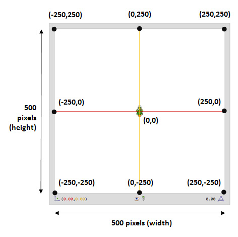
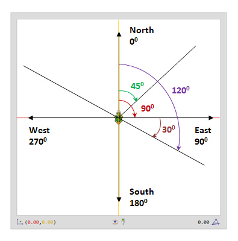

# Introduction à la programmation part. 1


***


## Logo
- Logo est un langage de programmation inventé dans les années 60 à Cambridge pour faire découvrir la programmation
- Il permet de faire bouger une tortue sur une surface et de la faire dessiner ou écrire du texte
- C'est un language qui possède la plupart des concepts fondamentaux des autres langages modernes (comme JS, PHP, C, Java, etc.)


***


## Prise en main de Turtle Logo
- Aller sur https://inexorabletash.github.io/jslogo/
- Écrire le programme suivant dans l'éditeur, puis appuyer sur Run ou CTLR+Enter :
```
fd 100
print "Bonjour\ monde
```
- La tortue doit avancer et "Bonjour monde" doit être écrit dans la partie texte


---


## L'espace de la tortue 1/2



***


## L'espace de la tortue 2/2



***


## Commandes pour déplacer la tortue
- Une commande correspond à l'appel d'une procedure avec ses arguments, c'est-à-dire une ligne de programme
- Les procèdures pour déplacer la tortue utilisent un nombre comme unique argument
- `fd expression` ou `forward expression` pour avancer la torture (points)
- `bk expression` ou `backward expression` pour reculer la tortue (points)
- `rt expression` ou `right expression` pour tourner la tortue à droite (degrés)
- `lt expression` ou `left expression` pour tourner la tortue à gauche (degrés)


***


## Autres commandes utiles
- `cs` ou `clearscreen` permet de réinitialiser l'écran
- `ct` ou `cleartext`permet d'effacer la partie texte
- `home` ramène la tortue au milieu de l'écran (position 0, 0)


***


## Exercice 1
- Faire dessiner un carré par la tortue


---


## Expressions
- Une expression est le résultat d'une commande ou d'une opération
- Exemples d'expressions :
```
2+2
random 10
```
- Les expression s'utilisent comme arguments des procédures, comme par exemple dans le programme suivant :
```
cs
rt random (90*4)
fd (random 100)*2
```


---


## Conditions
- Une condition permet d'exécuter des commandes en fonction du résultat d'un test
- Une condition est soit vraie, soit fausse, et se construit avec =, <, >
- Syntaxe en Logo :
```
if condition [ commandes ... ]
ifelse condition [ commandes ... ] [ commandes ... ]
```
- Exemples :
```
if 2+2=4 [ print "Toto ]
ifelse (random 2) = 0 [ rt 10 fd 10 ] [ bk 10]
```


***


## Exercice 2
1. L'expression `last mousepos` donne la position en hauteur de la souris, afficher sa valeur avec `print` et trouver le milieu de l'écran (la valeur 0)
2. Faites :
    - *avancer* la tortue de 10 si elle est vers le haut de l'écran
    - *reculer* la tortue de 10 si elle est vers le bas de l'écran


***


## Exercice 2 (suite)
1. L'expression `first mousepos` donne la position en largeur de la souris, afficher sa valeur avec `print` et trouver le milieu de l'écran (la valeur 0)
2. En plus de la première partie de l'exercie, faites :
    - *tourner vers la droite* de 10 la tortue si la souris est à droite de l'écran
    - *tourner vers la gauche* de 10 la tortue si la souris est à gauche de l'écran


---


## La prochaine fois
- Toujours faire bouger la tortue
- Découverte des variables et des boucles
